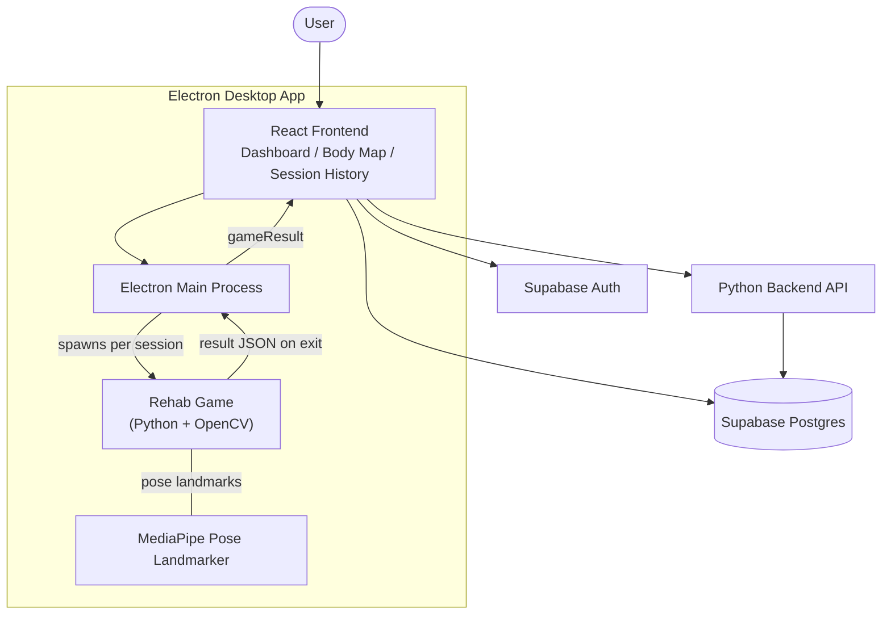

<div align="center">

## RehabVerse

[](./LICENSE)


**Play. Recover. Thrive.**

</div>
Gamified physiotherapy for post-surgery recovery. RehabVerse replaces static exercise sheets with a dashboard and a library of camera-based games that measure real joint angles, hold time, and stability using real-time pose tracking.

## Table of Contents

- [Overview](#overview)
- [Features](#features)
- [Architecture](#architecture)
- [Getting Started](#getting-started)
  - [Prerequisites](#prerequisites)
  - [1. Clone the Repository](#1-clone-the-repository)
  - [2. Frontend Setup](#2-frontend-setup)
  - [3. Backend Setup](#3-backend-setup)
  - [4. Pose Landmarker Model](#4-pose-landmarker-model)
  - [5. Supabase Setup](#5-supabase-setup)
- [Running the App](#running-the-app)
- [Desktop App](#desktop-app)
- [Rehab Programs and Games](#rehab-programs-and-games)
- [How Progress Tracking Works](#how-progress-tracking-works)
- [Roadmap](#roadmap)
- [Team](#team)
- [License](#license)

## Overview

Post-surgery rehab is usually handed to patients as a printed exercise sheet, with no supervision and no record of whether it was actually done correctly, or at all. Adherence drops quickly, form goes uncorrected, and clinicians have no visibility between appointments.

RehabVerse addresses this by turning each prescribed exercise into a camera-based game. A webcam and a real-time pose-tracking model convert an instruction like "raise your arm to 70 degrees and hold for 45 seconds" into a measurable, playable objective, with joint angle, hold time, and stability logged automatically for every session.

## Features

- **Surgery-specific recovery paths**: selecting a surgery/injury type and affected side automatically assigns the matching set of exercise games and optional bonus challenges.
- **Morning and evening sessions**: a twice-daily structure with a minimum cooldown between sessions, and week-by-week difficulty scaling (both target angle and hold time increase over time).
- **Real-time pose tracking**: MediaPipe pose landmarks measure actual joint angles and steadiness live, shown via an on-screen angle dial, hold-progress bar, and stability meter.
- **Adaptive difficulty**: if a session underperforms the previous one, both the angle target and hold-time target automatically ease for the next session, rather than staying static or penalizing the regression.
- **XP and league system**: completing sessions earns XP, placing the user into one of ten leagues.
- **Automatic missed/partial session logging**: a skipped or partially completed session is still retroactively recorded in history rather than silently disappearing.
- **Session history**: a full timeline of every session (completed, partial, or missed), including objectives and per-game performance metrics.
- **Interactive body map**: visually colors the affected region based on recovery progress, and only marks it "Recovered" once the longest exercise in that recovery path has completed its full week schedule, regardless of how many weeks that individual game defines.
- **Native desktop app**: packaged with Electron, since the games require direct OpenCV webcam access that a browser sandbox cannot provide.

## Architecture

RehabVerse is composed of three cooperating layers: a React UI, a set of native Python/OpenCV games launched as OS-level subprocesses, and Supabase as the backend service for authentication, data storage, and session history.



**Flow, in short:**

1. The user selects a recovery session from the React dashboard.
2. Electron's main process spawns the matching game as a native subprocess with webcam and pose-tracking access, passing session context (user, recovery, side, session type).
3. The game runs its own difficulty schedule, tracks the relevant joint angle live via MediaPipe, and returns a result object on exit.
4. The frontend writes that result to Supabase (`sessions`, `user_recoveries`, `user_progress`) and refreshes XP, streaks, and the body map.

## Getting Started

### Prerequisites

- Node.js 18+ and npm
- Python 3.10+
- A webcam
- A [Supabase](https://supabase.com) project (the free tier is sufficient)

### 1. Clone the Repository

```bash
git clone https://github.com/SrizaGoel/RehabVerse.git
cd RehabVerse
```

### 2. Frontend Setup

```bash
cd frontend
npm install
```

Create a `.env` file in `frontend/`:

```env
VITE_SUPABASE_URL=your-supabase-project-url
VITE_SUPABASE_ANON_KEY=your-supabase-anon-key
```

### 3. Backend Setup

```bash
cd backend
python -m venv venv
venv\Scripts\activate      # Windows
source venv/bin/activate   # macOS/Linux

pip install -r requirements.txt
```

### 4. Pose Landmarker Model

Not committed to the repository (binary asset, approximately 5.5 MB). Download it into both the project root and `backend/`:

```bash
curl -o pose_landmarker_lite.task https://storage.googleapis.com/mediapipe-models/pose_landmarker/pose_landmarker_lite/float16/latest/pose_landmarker_lite.task
copy pose_landmarker_lite.task backend\pose_landmarker_lite.task   # Windows
# cp pose_landmarker_lite.task backend/pose_landmarker_lite.task  # macOS/Linux
```

### 5. Supabase Setup

1. Create a Supabase project.
2. Run `schema.sql` in the Supabase SQL editor to create the `profiles`, `user_progress`, `user_recoveries`, and `sessions` tables.
3. Add the project URL and anon key to `frontend/.env` as shown above.

## Running the App

```bash
# Frontend (web, dev mode)
cd frontend && npm run dev

# Backend
cd backend && python app.py

```

## Desktop App

The games require direct OpenCV webcam access, which a browser cannot provide, so RehabVerse ships as a native Electron desktop application. Electron loads the built React frontend and spawns the matching PyInstaller-packaged game executable as a subprocess per session.

**[Download RehabVerse Desktop — Releases](https://drive.google.com/file/d/1xW2UH7NB0lRPD3ONGSLD1p8UrQ4UT2YH/view?usp=sharing)**


## Rehab Programs and Games

| Body Part | Surgeries / Conditions | Exercise Games | Bonus Challenges |
|---|---|---|---|
| Shoulder | Rotator Cuff Repair, Frozen Shoulder, Shoulder Arthroscopy, Shoulder Replacement, Labrum Repair | Forgotten Orchestra, Aether Guardian, Tide Caller, Phoenix Ascend | Paint the Object, Belle Pose |
| Elbow | Tennis Elbow, Golfer's Elbow, Elbow Arthroscopy, Distal Biceps Repair, Triceps Repair | Elbow Fishing | — |
| Knee | ACL Reconstruction, Meniscus Repair, Knee Replacement, Patellar Repair | Leg Raise | — |

Each game runs its own difficulty curve, target joint angle per week, hold-time per day within a week, and eases automatically if a session underperforms the previous one.

## How Progress Tracking Works

- Sessions log objectives (e.g. "Flexion Target Met") and metrics (target angle, hold time, stability percentage) per attempt.
- Missed or partial sessions are backfilled into history automatically the next time the dashboard loads on a later day.
- Recovery completion per body part is driven by whichever exercise in that path has the longest week schedule; the body map only shows "Recovered" once that longest exercise is fully complete.
- XP and streaks update on session completion and reset on missed evening sessions.

## Roadmap

- Additional games for remaining body regions
- Therapist/clinician dashboard for remote monitoring
- Configurable per-patient difficulty overrides
- Mobile companion app

## Team

RehabVerse is built and maintained by two developers:

- **Sriza Goel** - [GitHub](https://github.com/SrizaGoel)
- **Toyesh Gupta** - [GitHub](https://github.com/toyesh3gupta)


## License

Licensed under the [MIT License](./LICENSE) 